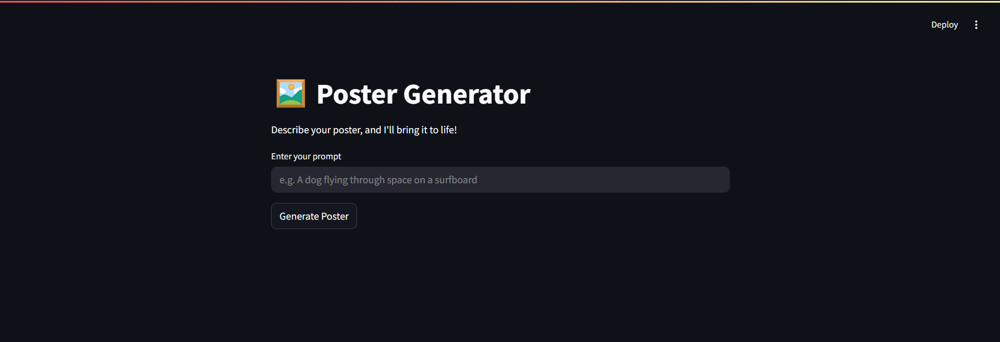

# 🖼️ AI Image   Generator
Built to explore GenAI, this interactive app lets users generate AI-powered images by simply typing a prompt! 

## 🧩 Tech Stack 
| Layer              | Tool / Tech Used                    | Why                                                                 |
|--------------------|-------------------------------------|----------------------------------------------------------------------|
| 🧠 GenAI Model      | `Stable Diffusion` via `diffusers`  | Open-source, great results, no API needed                           |
| 🌐 Frontend        | `Streamlit`                         | Super fast UI building with Python                                  |
| 🎨 Image display   | `Streamlit` / `PIL` (optional)      | Display results beautifully                                         |
| 📦 Environment     | `Python`, `pip`, `virtualenv`       | Clean and reproducible development                                  |
| 💻 Inference       | `CPU / GPU`                         | Runs locally, depending on your system                              |

## 🧰 Further Modifications (To be added)
- Let users download posters
- Add style presets (vintage, minimal, 3D, etc.)
- Improve prompt guidance (like ChatGPT does)
- Allow saving poster history

## 🧠 App UI

